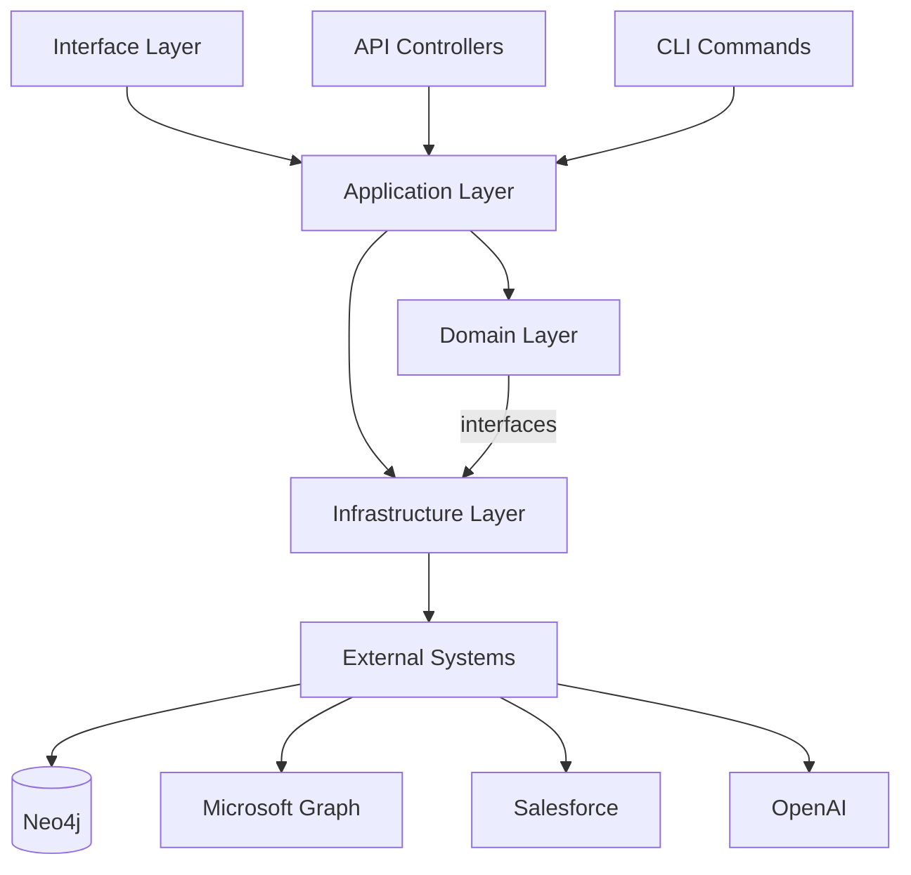

# 🏗️ Improved App Architecture

## 🎯 Architectural Principles

### Clean Architecture
- **Domain Layer**: Business logic and entities (center)
- **Application Layer**: Use cases and orchestration
- **Infrastructure Layer**: External concerns (DB, APIs, etc.)
- **Interface Layer**: Controllers, presenters, UI

### Domain-Driven Design (DDD)
- **Bounded Contexts**: CRM, Finance, Communication, Analytics
- **Aggregates**: Deal, Contact, Task, Email, Investment
- **Value Objects**: Money, DateRange, Probability, Stage
- **Domain Services**: Deal probability calculation, insight generation

---

## 📁 Improved Folder Structure

```
src/
├── 📁 domain/                          # Core business logic (no dependencies)
│   ├── 📁 entities/                    # Domain entities
│   │   ├── deal.ts                     # Deal aggregate root
│   │   ├── contact.ts                  # Contact entity
│   │   ├── task.ts                     # Task entity
│   │   ├── email.ts                    # Email entity  
│   │   └── investment.ts               # Investment entity
│   ├── 📁 value-objects/               # Immutable value objects
│   │   ├── money.ts                    # Currency handling
│   │   ├── date-range.ts               # Date periods
│   │   ├── probability.ts              # 0-1 probability values
│   │   ├── deal-stage.ts               # Deal lifecycle stages
│   │   └── contact-info.ts             # Email, phone, etc.
│   ├── 📁 repositories/                # Repository interfaces
│   │   ├── deal-repository.ts
│   │   ├── contact-repository.ts
│   │   └── email-repository.ts
│   ├── 📁 services/                    # Domain services
│   │   ├── deal-probability-service.ts
│   │   ├── insight-generation-service.ts
│   │   └── deal-lifecycle-service.ts
│   └── 📁 events/                      # Domain events
│       ├── deal-stage-changed.ts
│       ├── task-completed.ts
│       └── email-received.ts
│
├── 📁 application/                     # Use cases and app services
│   ├── 📁 use-cases/                   # Business use cases
│   │   ├── 📁 deal/
│   │   │   ├── create-deal.use-case.ts
│   │   │   ├── update-deal-stage.use-case.ts
│   │   │   └── calculate-deal-probability.use-case.ts
│   │   ├── 📁 communication/
│   │   │   ├── process-email.use-case.ts
│   │   │   ├── extract-entities.use-case.ts
│   │   │   └── sync-communications.use-case.ts
│   │   └── 📁 insights/
│   │       ├── generate-insights.use-case.ts
│   │       └── detect-patterns.use-case.ts
│   ├── 📁 agents/                      # Cursor agents
│   │   ├── crm-agent.ts                # CRM query agent
│   │   ├── deal-expert-agent.ts        # Financial expertise agent
│   │   └── base-agent.ts               # Agent base class
│   ├── 📁 dto/                         # Data transfer objects
│   │   ├── deal.dto.ts
│   │   ├── contact.dto.ts
│   │   └── insight.dto.ts
│   └── 📁 ports/                       # Interfaces for external systems
│       ├── email-provider.port.ts
│       ├── crm-provider.port.ts
│       └── llm-provider.port.ts
│
├── 📁 infrastructure/                  # External system implementations
│   ├── 📁 database/                    # Database implementations
│   │   ├── 📁 neo4j/
│   │   │   ├── neo4j-connection.ts
│   │   │   ├── neo4j-deal-repository.ts
│   │   │   ├── neo4j-contact-repository.ts
│   │   │   └── cypher-query-builder.ts
│   │   └── 📁 migrations/
│   │       ├── 001-initial-schema.cypher
│   │       └── 002-add-indexes.cypher
│   ├── 📁 external-apis/               # External API clients
│   │   ├── 📁 microsoft-graph/
│   │   │   ├── graph-client.ts
│   │   │   ├── email-adapter.ts
│   │   │   └── graph-types.ts
│   │   ├── 📁 salesforce/
│   │   │   ├── salesforce-client.ts
│   │   │   ├── task-adapter.ts
│   │   │   └── contact-adapter.ts
│   │   └── 📁 openai/
│   │       ├── openai-client.ts
│   │       └── prompt-templates.ts
│   ├── 📁 ontology/                    # Ontology management
│   │   ├── 📁 schemas/
│   │   │   ├── crm-ontology.owl
│   │   │   ├── finance-ontology.owl
│   │   │   └── combined-schema.ttl
│   │   ├── ontology-manager.ts
│   │   ├── rdf-triple-mapper.ts
│   │   └── sparql-query-builder.ts
│   ├── 📁 nlp/                         # NLP processing
│   │   ├── entity-extractor.ts
│   │   ├── intent-classifier.ts
│   │   ├── semantic-analyzer.ts
│   │   └── 📁 models/
│   │       ├── spacy-model.ts
│   │       └── custom-ner-model.ts
│   ├── 📁 messaging/                   # Event handling
│   │   ├── event-bus.ts
│   │   ├── message-handlers.ts
│   │   └── 📁 handlers/
│   │       ├── deal-stage-changed-handler.ts
│   │       └── email-received-handler.ts
│   └── 📁 caching/                     # Caching layer
│       ├── redis-cache.ts
│       └── in-memory-cache.ts
│
├── 📁 interface/                       # External interfaces
│   ├── 📁 web/                         # Web interface
│   │   ├── 📁 controllers/             # API controllers
│   │   │   ├── deal.controller.ts
│   │   │   ├── agent.controller.ts
│   │   │   └── insight.controller.ts
│   │   ├── 📁 middleware/              # Express middleware
│   │   │   ├── auth.middleware.ts
│   │   │   ├── validation.middleware.ts
│   │   │   └── error.middleware.ts
│   │   ├── 📁 routes/                  # API routes
│   │   │   ├── api.routes.ts
│   │   │   ├── deal.routes.ts
│   │   │   └── agent.routes.ts
│   │   └── app.ts                      # Express app setup
│   ├── 📁 ui/                          # React frontend
│   │   ├── 📁 components/              # React components
│   │   │   ├── 📁 common/              # Shared components
│   │   │   │   ├── Layout.tsx
│   │   │   │   ├── LoadingSpinner.tsx
│   │   │   │   └── ErrorBoundary.tsx
│   │   │   ├── 📁 deal/                # Deal-related components
│   │   │   │   ├── DealCard.tsx
│   │   │   │   ├── DealTimeline.tsx
│   │   │   │   └── DealProbability.tsx
│   │   │   ├── 📁 insights/            # Insight components
│   │   │   │   ├── InsightPanel.tsx
│   │   │   │   └── InsightCard.tsx
│   │   │   └── 📁 agent/               # Agent interface
│   │   │       ├── AgentChat.tsx
│   │   │       └── QueryInput.tsx
│   │   ├── 📁 hooks/                   # Custom React hooks
│   │   │   ├── useDeals.ts
│   │   │   ├── useInsights.ts
│   │   │   └── useAgent.ts
│   │   ├── 📁 store/                   # State management
│   │   │   ├── store.ts                # Redux store
│   │   │   ├── dealSlice.ts
│   │   │   └── insightSlice.ts
│   │   ├── 📁 pages/                   # Page components
│   │   │   ├── Dashboard.tsx
│   │   │   ├── DealsPage.tsx
│   │   │   └── InsightsPage.tsx
│   │   └── main.tsx                    # React entry point
│   ├── 📁 cli/                         # Command line interface
│   │   ├── cli.ts                      # CLI entry point
│   │   ├── 📁 commands/                # CLI commands
│   │   │   ├── import-data.command.ts
│   │   │   ├── sync-crm.command.ts
│   │   │   └── generate-insights.command.ts
│   │   └── 📁 utils/
│   │       └── cli-helpers.ts
│   ├── 📁 shared/                          # Shared utilities
│   │   ├── 📁 utils/                       # Common utilities
│   │   │   ├── logger.ts
│   │   │   ├── date-utils.ts
│   │   │   ├── validation.ts
│   │   │   └── type-guards.ts
│   │   ├── 📁 constants/                   # Application constants
│   │   │   ├── deal-stages.ts
│   │   │   ├── task-statuses.ts
│   │   │   └── api-endpoints.ts
│   │   ├── 📁 types/                       # Shared type definitions
│   │   │   ├── common.types.ts
│   │   │   ├── api.types.ts
│   │   │   └── domain.types.ts
│   │   └── 📁 config/                      # Configuration
│   │       ├── database.config.ts
│   │       ├── api.config.ts
│   │       └── app.config.ts
│   ├── 📁 test/                            # Test files (mirrors src structure)
│   │   ├── 📁 unit/                        # Unit tests
│   │   │   ├── 📁 domain/
│   │   │   ├── 📁 application/
│   │   │   └── 📁 infrastructure/
│   │   ├── 📁 integration/                 # Integration tests
│   │   │   ├── 📁 database/
│   │   │   ├── 📁 api/
│   │   │   └── 📁 external-services/
│   │   ├── 📁 e2e/                         # End-to-end tests
│   │   │   ├── deal-workflow.e2e.test.ts
│   │   │   └── agent-interaction.e2e.test.ts
│   │   ├── 📁 fixtures/                    # Test data
│   │   │   ├── deals.fixture.ts
│   │   │   ├── emails.fixture.ts
│   │   │   └── contacts.fixture.ts
│   │   ├── 📁 mocks/                       # Test mocks
│   │   │   ├── neo4j.mock.ts
│   │   │   ├── graph-api.mock.ts
│   │   │   └── openai.mock.ts
│   │   └── 📁 utils/                       # Test utilities
│   │       ├── test-helpers.ts
│   │       └── database-setup.ts
│   └── 📁 docs/                            # Documentation
│       ├── api.md                          # API documentation
│       ├── deployment.md                   # Deployment guide
│       ├── ontology.md                     # Ontology documentation
│       └── 📁 diagrams/                    # Architecture diagrams
│           ├── system-overview.mmd
│           ├── database-schema.mmd
│           └── data-flow.mmd
```

---

## 🏛️ Architecture Benefits

### 1. **Separation of Concerns**
- Domain logic isolated from infrastructure
- Clear boundaries between layers
- Easy to test each layer independently

### 2. **Dependency Inversion**
- Domain doesn't depend on infrastructure
- Use interfaces/ports for external dependencies
- Easy to swap implementations

### 3. **Scalability**
- Modular structure allows team scaling
- Each bounded context can be developed independently
- Clear API contracts between modules

### 4. **Testability**
- Domain logic is pure (no external dependencies)
- Infrastructure can be mocked easily
- Clear test categories (unit/integration/e2e)

### 5. **Maintainability**
- Single Responsibility Principle
- Open/Closed Principle
- Clear naming conventions

---

## 🔧 Key Architectural Patterns

### Repository Pattern
```typescript
// Domain (interface)
export interface DealRepository {
  findById(id: string): Promise<Deal | null>;
  save(deal: Deal): Promise<void>;
  findByStage(stage: DealStage): Promise<Deal[]>;
}

// Infrastructure (implementation)
export class Neo4jDealRepository implements DealRepository {
  // Implementation details
}
```

### Use Case Pattern
```typescript
export class UpdateDealStageUseCase {
  constructor(
    private dealRepository: DealRepository,
    private eventBus: EventBus
  ) {}

  async execute(dealId: string, newStage: DealStage): Promise<void> {
    const deal = await this.dealRepository.findById(dealId);
    deal.updateStage(newStage);
    await this.dealRepository.save(deal);
    await this.eventBus.publish(new DealStageChangedEvent(deal));
  }
}
```

### Agent Pattern
```typescript
export class CRMAgent extends BaseAgent {
  constructor(
    private dealUseCase: GetDealUseCase,
    private taskUseCase: GetTasksUseCase,
    private llmProvider: LLMProvider
  ) {
    super();
  }

  async processQuery(query: string): Promise<string> {
    const intent = await this.classifyIntent(query);
    const context = await this.gatherContext(intent);
    return this.generateResponse(context, query);
  }
}
```

---

## 📊 Dependency Flow



This architecture provides:
- **Clean separation** of business logic from technical concerns
- **Easy testing** with clear mock points
- **Scalable structure** that grows with your team
- **Flexible deployment** options (monolith → microservices)
- **Clear ownership** of code by different team members 