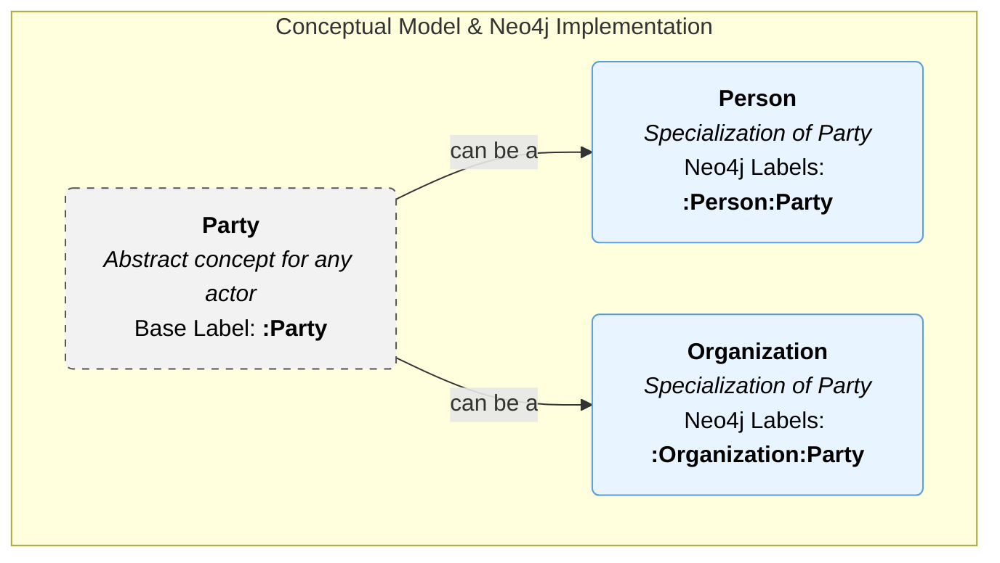

# Email Ingestion Ontology and Process

## Overview

This document explains how email ingestion works in our system. The process transforms raw email data into a structured knowledge graph, enabling advanced analysis, search, and business intelligence.

## 📧 Email Ingestion Process

The ingestion pipeline follows a streamlined, multi-step process:

### 1. Email Parsing
When an email arrives, the system parses it to extract basic information:
- **Headers**: From, To, CC, Subject, Message-ID.
- **Content**: Plain text body.
- **Metadata**: Timestamps.

### 2. Batch NLP Extraction
The core of the process is the interaction with our Python-based NLP service.
- **Batching**: The text content of all emails is gathered into a single batch.
- **API Call**: This batch is sent to the `/batch-extract-graph` endpoint of the NLP service.
- **Concurrent Processing**: The NLP service uses a Large Language Model (LLM), constrained by our system's combined ontologies, to process all documents in parallel.
- **Structured Output**: The service returns a list of structured graph objects, each containing the entities and relationships found in the corresponding email.
- **Vector Embeddings**: A subsequent batch call enriches all extracted entities with semantic vector embeddings for similarity searches.

### 3. Knowledge Graph Ingestion
For each processed email, the system performs the following steps in Neo4j:

1.  **Create `Communication` Node**: A single `:Communication` node is created to represent the email itself, storing properties like subject, date, and source file.
2.  **Entity Resolution & Creation**: For each entity returned by the NLP service:
    - A **vector similarity search** is performed to see if a similar entity already exists in the graph.
    - If a close match is found, the existing node is used.
    - Otherwise, a new entity node is created with the appropriate labels (e.g., `:Person`, `:Organization`) and its vector embedding is stored as a property.
3.  **Link Entities to Communication**: The `Communication` node is linked to all the entity nodes that were mentioned within it using a `[:CONTAINS_ENTITY]` relationship.
4.  **Create Entity Relationships**: The direct relationships between entities (e.g., `(Person)-[:WORKS_FOR]->(Organization)`) are created in the graph.

This process results in a rich, interconnected knowledge graph that accurately models the information contained in the emails.

## 🏛️ Actor Modeling: Person and Organization

In our CRM ontology, which is inspired by O-CREAM, we distinguish between two main types of actors: **Persons** (individuals) and **Organizations** (companies, institutions). To model this relationship efficiently and enable flexible queries, we adopt the concept of a generalized **`Party`** and leverage Neo4j's multi-labeling feature.

### The `Party` Concept

`Party` is an abstract concept representing any actor that can participate in a business relationship or transaction. It is not directly instantiated but serves as a parent class for `Person` and `Organization`. This approach allows us to define common properties and relationships (like owning an asset or participating in a communication) at a higher level of abstraction.

### Neo4j Multi-Label Implementation

This conceptual hierarchy is implemented in Neo4j using multi-labels:
- A node representing an individual will have both the `:Person` and `:Party` labels.
- A node representing a company will have both the `:Organization` and `:Party` labels.

This strategy offers significant querying advantages:
- **Query all actors**: `MATCH (p:Party) RETURN p`
- **Query only persons**: `MATCH (p:Person) RETURN p`
- **Query only organizations**: `MATCH (o:Organization) RETURN o`

The following diagram illustrates this model:



## 🧠 Ontological Benefits

### **Semantic Search**
Query for communications about a specific topic or involving a specific person:
```cypher
// Find all communications involving 'Vista Equity Partners'
MATCH (c:Communication)-[:CONTAINS_ENTITY]->(o:Organization {name: 'Vista Equity Partners'})
RETURN c.subject, c.date
ORDER BY c.date DESC
```

### **Relationship Discovery**
Find all people who work for a specific company:
```cypher
MATCH (p:Person)-[:WORKS_FOR]->(o:Organization {name: 'Morgan Stanley'})
RETURN p.name
```

### **Business Intelligence**
Discover which deals a specific investor is associated with:
```cypher
MATCH (i:Investor {name: 'Vista Equity Partners'})<-[:INVESTED_IN]-(d:Deal)
RETURN d.name
```

This streamlined, ontology-driven process ensures that high-quality, structured data is extracted from unstructured emails, powering the intelligent features of the application.

## 🔄 Integration Points

### **Email Providers**
- **IMAP/POP3** for traditional email servers
- **Microsoft Graph API** for Office 365/Outlook
- **Gmail API** for Google Workspace
- **Exchange Web Services** for on-premise Exchange

### **NLP Services**
- **Azure Cognitive Services** for advanced text analysis
- **AWS Comprehend** for sentiment and entity extraction
- **Google Cloud Natural Language** for topic modeling
- **Custom ML models** for domain-specific classification

### **Knowledge Graph**
- **Neo4j** as primary graph database
- **Apache Jena** for RDF/OWL reasoning
- **Amazon Neptune** for cloud-based graph storage
- **ArangoDB** for multi-model graph operations

## 📊 Analytics & Insights

### **Communication Patterns**
- Email frequency analysis by contact/organization
- Response time patterns and trends
- Communication network visualization
- Seasonal communication trends

### **Content Intelligence**
- Topic clustering and trend analysis
- Sentiment evolution over time
- Business opportunity identification
- Risk and escalation detection

### **Customer Health Scoring**
- Communication frequency and recency
- Sentiment trend analysis
- Engagement level assessment
- Relationship strength indicators

## 🔒 Privacy & Security

### **Data Classification**
- `public` - Marketing and public communications
- `internal` - Standard business communications
- `confidential` - Sensitive business information
- `restricted` - Highly sensitive or regulated content

### **Access Control**
- Role-based access to knowledge elements
- Encryption of sensitive email content
- Audit trails for all ontological operations
- GDPR compliance for personal data

### **Data Retention**
- Configurable retention policies by classification
- Automatic archival of old communications
- Secure deletion of expired data
- Backup and recovery procedures

## 🚀 Advanced Features

### **Machine Learning Integration**
- **Automatic classification** improvement over time
- **Anomaly detection** for unusual communication patterns
- **Predictive analytics** for customer behavior
- **Recommendation engines** for follow-up actions

### **Real-time Processing**
- **Stream processing** for immediate email ingestion
- **Event-driven architecture** for scalable processing
- **WebSocket notifications** for real-time updates
- **Batch processing** for historical data migration

### **Multi-language Support**
- **Language detection** for international communications
- **Translation services** integration
- **Locale-specific** sentiment analysis
- **Cultural context** consideration in analysis

## 📈 Performance Optimization

### **Scalability**
- **Horizontal scaling** of ingestion services
- **Distributed processing** for large email volumes
- **Caching strategies** for frequently accessed data
- **Load balancing** across processing nodes

### **Efficiency**
- **Incremental processing** to avoid reprocessing
- **Smart filtering** to focus on relevant emails
- **Batch operations** for bulk knowledge creation
- **Optimized queries** for graph traversal

This ontological approach to email ingestion transforms raw communication data into actionable business intelligence, enabling sophisticated CRM capabilities that understand context, relationships, and business value. 