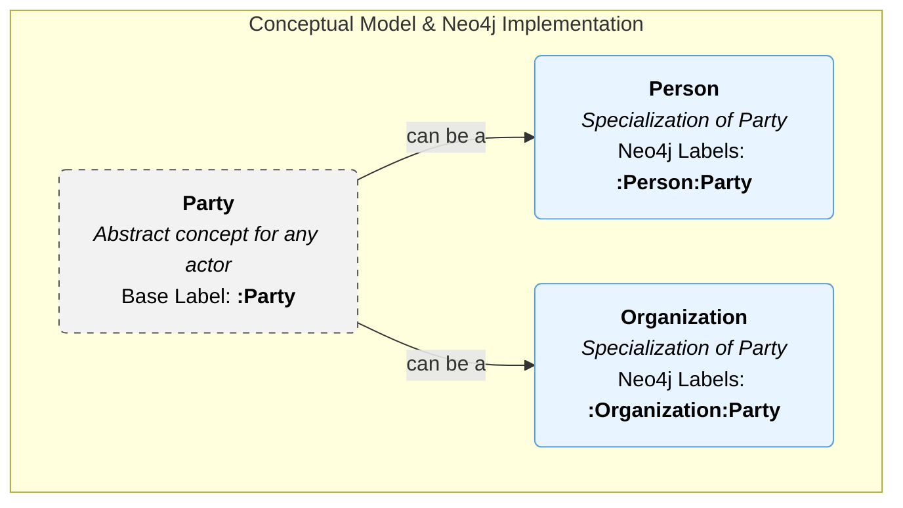

# Email Ingestion into O-CREAM-v2 Ontology

## Overview

This document explains how email ingestion works in our CRM system using the O-CREAM-v2 (Ontology for Customer Relationship Management v2) framework. The system transforms raw email data into structured ontological knowledge that can be analyzed, searched, and leveraged for intelligent CRM operations.

## 📧 Email Ingestion Process

### 1. Email Reception & Parsing

When an email arrives, the system:
- **Parses email headers** (From, To, CC, Subject, Message-ID, etc.)
- **Extracts content** (plain text body, HTML body, attachments)
- **Identifies thread context** (In-Reply-To, References, Thread-ID)
- **Captures metadata** (timestamps, email provider, size, etc.)

### 2. Contact Resolution

The system identifies or creates contacts:
- **Lookup existing contacts** by email address
- **Create new contacts** if not found, extracting names from email addresses
- **Update contact information** with new data discovered in emails
- **Link contacts to organizations** based on email domains when applicable

### 3. Email Analysis & Classification

Advanced analysis extracts semantic information:

#### **Content Classification**
- `general` - Standard communications
- `meeting_request` - Calendar/scheduling related
- `business_proposal` - Sales and proposal content
- `support_request` - Customer service inquiries
- `financial` - Invoices, payments, financial discussions

#### **Sentiment Analysis**
- `positive` - Thank you notes, approvals, positive feedback
- `neutral` - Standard business communications
- `negative` - Complaints, issues, concerns

#### **Priority Detection**
- `high` - Urgent keywords, exclamation marks, deadline language
- `medium` - Standard business communications
- `low` - FYI, optional, informational content

#### **Entity Extraction**
- Email addresses, phone numbers, dates
- Company names, project names, monetary amounts
- Technical terms and product references

### 4. Ontological Knowledge Creation

The system creates multiple types of O-CREAM-v2 knowledge elements:

#### **Communication Log Knowledge Element**
```typescript
{
  type: KnowledgeType.COMMUNICATION_LOG,
  title: "Email Communication: [Subject]",
  content: {
    messageId: "unique-message-id",
    subject: "email subject",
    body: "email content",
    classification: "business_proposal",
    sentiment: "positive",
    priority: "high",
    participants: ["sender@domain.com", "recipient@domain.com"]
  },
  reliability: 0.95,
  confidentiality: "internal"
}
```

#### **Customer Interaction History**
```typescript
{
  type: KnowledgeType.INTERACTION_HISTORY,
  title: "Customer Interaction: [Email Address]",
  content: {
    interactionType: "email",
    timestamp: "2024-01-15T10:30:00Z",
    summary: "Project proposal discussion",
    sentiment: "positive",
    topics: ["project", "proposal", "meeting"],
    outcome: "received",
    followUpRequired: true
  },
  reliability: 0.9,
  confidentiality: "internal"
}
```

#### **Business Knowledge Elements**
For business-critical emails:
```typescript
{
  type: KnowledgeType.TRANSACTION_DATA,
  title: "Business Communication: [Subject]",
  content: {
    businessContext: ["proposal", "budget", "timeline"],
    extractedEntities: ["$50,000", "3 months", "CRM system"],
    priority: "high",
    requiresAction: true
  },
  reliability: 0.8,
  confidentiality: "confidential"
}
```

#### **Document Management**
For email attachments:
```typescript
{
  type: KnowledgeType.DOCUMENT_MANAGEMENT,
  title: "Email Attachment: [Filename]",
  content: {
    filename: "project_proposal.pdf",
    contentType: "application/pdf",
    size: 245760,
    requiresProcessing: true
  },
  reliability: 1.0,
  confidentiality: "confidential"
}
```

### 5. Activity Creation

The system creates O-CREAM-v2 activities to track email interactions:

#### **Data Collection Activity**
```typescript
{
  type: ActivityType.DATA_COLLECTION,
  name: "Email Received",
  description: "Email received from john.doe@acme.com: Urgent proposal",
  participants: ["contact-id-1", "contact-id-2"],
  startTime: "2024-01-15T10:30:00Z",
  status: "completed",
  context: {
    emailProvider: "Gmail",
    hasAttachments: true,
    priority: "high"
  }
}
```

#### **Customer Support Activity**
```typescript
{
  type: ActivityType.CUSTOMER_SUPPORT,
  name: "Customer Email Communication",
  description: "Email communication with customer",
  outcome: "Email received: Project proposal discussion",
  context: {
    communicationType: "email",
    direction: "inbound",
    priority: "high"
  }
}
```

### 6. Relationship Management

The system establishes ontological relationships:

#### **Communication Relationships**
```typescript
{
  relationshipType: "COMMUNICATION",
  sourceEntityId: "sender-contact-id",
  targetEntityId: "recipient-contact-id",
  sourceRole: "sender",
  targetRole: "recipient",
  properties: {
    communicationType: "email",
    frequency: "occasional"
  },
  strength: 0.5
}
```

### 7. Knowledge Graph Storage

All ontological data is stored in the knowledge graph:
- **Neo4j nodes** for entities (contacts, communications, knowledge elements)
- **Relationships** connecting related entities
- **Properties** storing metadata and analysis results
- **Indexes** for fast semantic search and retrieval

## 🏛️ Actor Modeling: Person and Organization

In our CRM ontology, which is inspired by O-CREAM, we distinguish between two main types of actors: **Persons** (individuals) and **Organizations** (companies, institutions). To model this relationship efficiently and enable flexible queries, we adopt the concept of a generalized **`Party`** and leverage Neo4j's multi-labeling feature.

### The `Party` Concept

`Party` is an abstract concept representing any actor that can participate in a business relationship or transaction. It is not directly instantiated but serves as a parent class for `Person` and `Organization`. This approach allows us to define common properties and relationships (like owning an asset or participating in a communication) at a higher level of abstraction.

### Neo4j Multi-Label Implementation

This conceptual hierarchy is implemented in Neo4j using multi-labels:
- A node representing an individual will have both the `:Person` and `:Party` labels.
- A node representing a company will have both the `:Organization` and `:Party` labels.

This strategy offers significant querying advantages:
- **Query all actors**: `MATCH (p:Party) RETURN p`
- **Query only persons**: `MATCH (p:Person) RETURN p`
- **Query only organizations**: `MATCH (o:Organization) RETURN o`

The following diagram illustrates this model:



## 🧠 Ontological Benefits

### **Semantic Search**
Query emails by ontological properties:
```cypher
MATCH (c:Contact)-[:HAS_KNOWLEDGE]->(ke:KnowledgeElement)
WHERE ke.type = 'COMMUNICATION_LOG' 
  AND ke.sentiment = 'positive'
  AND ke.priority = 'high'
RETURN c, ke
```

### **Relationship Discovery**
Find communication patterns:
```cypher
MATCH (c1:Contact)-[r:COMMUNICATION]->(c2:Contact)
WHERE r.frequency = 'frequent'
RETURN c1, c2, r
```

### **Business Intelligence**
Analyze customer interactions:
```cypher
MATCH (c:Contact)-[:HAS_ACTIVITY]->(a:Activity)
WHERE a.type = 'CUSTOMER_SUPPORT'
  AND a.startTime > date('2024-01-01')
RETURN c.email, count(a) as interaction_count
ORDER BY interaction_count DESC
```

### **Knowledge Aggregation**
Combine insights across interactions:
```cypher
MATCH (c:Contact)-[:HAS_KNOWLEDGE]->(ke:KnowledgeElement)
WHERE ke.type = 'INTERACTION_HISTORY'
RETURN c.email, 
       avg(ke.sentiment_score) as avg_sentiment,
       collect(ke.topics) as all_topics
```

## 🔄 Integration Points

### **Email Providers**
- **IMAP/POP3** for traditional email servers
- **Microsoft Graph API** for Office 365/Outlook
- **Gmail API** for Google Workspace
- **Exchange Web Services** for on-premise Exchange

### **NLP Services**
- **Azure Cognitive Services** for advanced text analysis
- **AWS Comprehend** for sentiment and entity extraction
- **Google Cloud Natural Language** for topic modeling
- **Custom ML models** for domain-specific classification

### **Knowledge Graph**
- **Neo4j** as primary graph database
- **Apache Jena** for RDF/OWL reasoning
- **Amazon Neptune** for cloud-based graph storage
- **ArangoDB** for multi-model graph operations

## 📊 Analytics & Insights

### **Communication Patterns**
- Email frequency analysis by contact/organization
- Response time patterns and trends
- Communication network visualization
- Seasonal communication trends

### **Content Intelligence**
- Topic clustering and trend analysis
- Sentiment evolution over time
- Business opportunity identification
- Risk and escalation detection

### **Customer Health Scoring**
- Communication frequency and recency
- Sentiment trend analysis
- Engagement level assessment
- Relationship strength indicators

## 🔒 Privacy & Security

### **Data Classification**
- `public` - Marketing and public communications
- `internal` - Standard business communications
- `confidential` - Sensitive business information
- `restricted` - Highly sensitive or regulated content

### **Access Control**
- Role-based access to knowledge elements
- Encryption of sensitive email content
- Audit trails for all ontological operations
- GDPR compliance for personal data

### **Data Retention**
- Configurable retention policies by classification
- Automatic archival of old communications
- Secure deletion of expired data
- Backup and recovery procedures

## 🚀 Advanced Features

### **Machine Learning Integration**
- **Automatic classification** improvement over time
- **Anomaly detection** for unusual communication patterns
- **Predictive analytics** for customer behavior
- **Recommendation engines** for follow-up actions

### **Real-time Processing**
- **Stream processing** for immediate email ingestion
- **Event-driven architecture** for scalable processing
- **WebSocket notifications** for real-time updates
- **Batch processing** for historical data migration

### **Multi-language Support**
- **Language detection** for international communications
- **Translation services** integration
- **Locale-specific** sentiment analysis
- **Cultural context** consideration in analysis

## 📈 Performance Optimization

### **Scalability**
- **Horizontal scaling** of ingestion services
- **Distributed processing** for large email volumes
- **Caching strategies** for frequently accessed data
- **Load balancing** across processing nodes

### **Efficiency**
- **Incremental processing** to avoid reprocessing
- **Smart filtering** to focus on relevant emails
- **Batch operations** for bulk knowledge creation
- **Optimized queries** for graph traversal

This ontological approach to email ingestion transforms raw communication data into actionable business intelligence, enabling sophisticated CRM capabilities that understand context, relationships, and business value. 