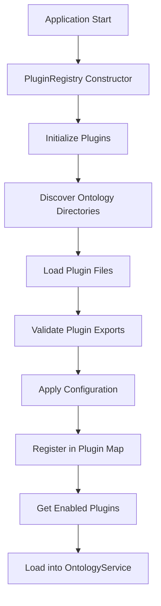

# Plugin Registration System

> **Status**: ✅ **Implemented and Active**

The plugin registration system provides automatic discovery, loading, and management of ontology plugins in the platform.

## Overview

The system uses a dynamic plugin registry that automatically discovers ontology plugins from the `ontologies/` directory and manages their lifecycle without requiring manual registration in code.

## Architecture

### Plugin Registry (`config/ontology/plugins.config.ts`)

The `PluginRegistry` class is the central component that:

1. **Discovers** ontology directories automatically
2. **Loads** plugin files (`*.plugin.ts`)
3. **Configures** plugin settings and status
4. **Provides** plugin management APIs

```typescript
class PluginRegistry {
  private plugins: Map<string, PluginConfig> = new Map();
  private readonly ontologiesDir = path.join(process.cwd(), 'ontologies');

  // Automatic discovery and loading
  private discoverOntologyPlugins(): void
  private loadOntologyPlugin(ontologyName: string): void
  
  // Public APIs
  public getEnabledPlugins(): OntologyPlugin[]
  public getPluginSummary(): { enabled: string[]; disabled: string[] }
  public isPluginEnabled(pluginName: string): boolean
  public setPluginEnabled(pluginName: string, enabled: boolean): void
}
```

### Plugin Configuration

Each plugin has a configuration that includes:

```typescript
interface PluginConfig {
  name: string;           // Plugin identifier
  enabled: boolean;       // Whether plugin is active
  plugin: OntologyPlugin; // The actual plugin instance
  description: string;    // Human-readable description
}
```

## Plugin Discovery Process

1. **Directory Scan**: Scans `ontologies/` directory for subdirectories
2. **Plugin File Detection**: Looks for `<ontology-name>.plugin.ts` files
3. **Dynamic Loading**: Uses `require()` to load plugin modules
4. **Export Validation**: Verifies the plugin exports the expected interface
5. **Configuration Setup**: Applies default and custom configurations
6. **Status Management**: Enables/disables plugins based on configuration

## Default Plugin Configuration

The system automatically enables these plugins by default:

- **Core**: Always enabled (fundamental entities)
- **CRM**: Enabled by default (customer relationship management)
- **Financial**: Enabled by default (financial instruments and deals)
- **Procurement**: Enabled by default (public procurement procedures)

## Plugin Loading Flow



## Usage Examples

### Getting Plugin Status

```typescript
import { getPluginSummary, isPluginEnabled } from '../config/ontology/plugins.config';

// Get overall plugin status
const summary = getPluginSummary();
console.log('Enabled plugins:', summary.enabled);
console.log('Disabled plugins:', summary.disabled);

// Check specific plugin
const procurementEnabled = isPluginEnabled('procurement');
console.log('Procurement enabled:', procurementEnabled);
```

### Loading Plugins into Ontology Service

```typescript
import { getEnabledPlugins } from '../config/ontology/plugins.config';
import { OntologyService } from '@platform/ontology/ontology.service';

// Get all enabled plugins
const enabledPlugins = getEnabledPlugins();

// Load into ontology service
const ontologyService = OntologyService.getInstance();
ontologyService.loadFromPlugins(enabledPlugins);
```

### Runtime Plugin Management

```typescript
import { pluginRegistry } from '../config/ontology/plugins.config';

// Enable/disable plugins at runtime
pluginRegistry.setPluginEnabled('procurement', false);
pluginRegistry.setPluginEnabled('financial', true);

// Reload plugins (useful for development)
pluginRegistry.reload();
```

## Plugin File Structure

Each ontology plugin follows this structure:

```
ontologies/
├── crm/
│   ├── crm.plugin.ts          # Plugin implementation
│   ├── ontology.json          # Entity/relationship schemas
│   ├── register.ts            # DI registration (optional)
│   └── __tests__/             # Plugin tests
├── financial/
│   ├── financial.plugin.ts
│   ├── ontology.json
│   ├── register.ts
│   └── __tests__/
└── procurement/
    ├── procurement.plugin.ts
    ├── ontology.json
    └── __tests__/
```

## Plugin Interface

All plugins must implement the `OntologyPlugin` interface:

```typescript
export interface OntologyPlugin {
  name: string;                                    // Required
  entitySchemas: Record<string, unknown>;         // Required
  relationshipSchemas?: Record<string, unknown>;  // Optional
  reasoning?: { algorithms: Record<string, ...> }; // Optional
  entityExtraction?: Record<string, unknown>;     // Optional
  serviceProviders?: Record<string, unknown>;     // Optional
}
```

## Error Handling

The system handles various error scenarios gracefully:

### Tsyringe Dependency Issues
When plugins have tsyringe dependencies (like CRM and Financial), the system:
- Logs a warning about service providers being unavailable
- Still loads the plugin's ontology schemas
- Continues operation without the DI registration

### Missing Plugin Files
- Logs a warning for missing plugin files
- Continues with other plugins
- Doesn't fail the entire system

### Invalid Plugin Exports
- Validates plugin exports before registration
- Logs warnings for missing exports
- Skips invalid plugins

## Testing

The plugin registration system includes comprehensive tests:

```bash
# Run plugin loading tests
npm test -- --testPathPattern="plugin-loading"

# Test specific plugin registration
npm test -- --testPathPattern="plugins.config.test"
```

## Configuration Files

### Custom Plugin Configuration

You can create `plugin.config.json` files in ontology directories to override defaults:

```json
{
  "enabled": true,
  "description": "Custom description for this ontology"
}
```

### Environment-Based Configuration

The system respects environment variables for plugin management:

```bash
# Disable specific plugins
DISABLE_PLUGINS=crm,financial

# Enable only specific plugins
ENABLE_ONLY_PLUGINS=core,procurement
```

## Benefits

1. **Zero Configuration**: Plugins are automatically discovered and loaded
2. **Runtime Management**: Enable/disable plugins without restart
3. **Error Resilience**: System continues working even if some plugins fail
4. **Extensibility**: Easy to add new ontologies without code changes
5. **Testability**: Each plugin can be tested in isolation
6. **Maintainability**: Clear separation between plugin logic and platform code

## Future Enhancements

- [ ] **Plugin Configuration UI**: Web interface for managing plugins
- [ ] **Plugin Marketplace**: Remote plugin loading and distribution
- [ ] **Plugin Versioning**: Support for plugin version management
- [ ] **Plugin Dependencies**: Handle inter-plugin dependencies
- [ ] **Plugin Hot Reloading**: Reload plugins without restarting the application 